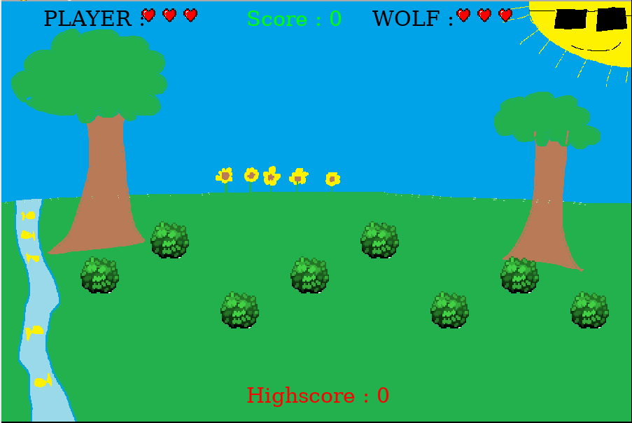

# 🐺 Werewolf Hunting Game  

A Python/Pygame strategy game where players hunt for a hidden wolf among bushes. Features health systems, score tracking, and dynamic difficulty.

 *(Add your own screenshot)*  

---

## 🎮 How to Play  
### Basic Rules  
1. **Objective**: Find the hidden wolf 3 times before losing all your hearts.  
2. **Controls**: Click on bushes to search.  
3. **Scoring**:  
   - Correct guess: Wolf loses 1 heart  
   - Wrong guess: You lose 1 heart  
   - Points awarded per successful hit:  
     - 30 pts (3 hearts remaining)  
     - 15 pts (2 hearts)  
     - 5 pts (1 heart)  

### Game Flow  
```mermaid
graph TD
    A[Start Game] --> B[Wolf hides randomly]
    B --> C[Player clicks bush]
    C --> D{Correct guess?}
    D -->|Yes| E[Damage wolf]
    D -->|No| F[Damage player]
    E --> G{Win?}
    F --> G
    G -->|No| B
    G -->|Yes| H[Update highscore]
